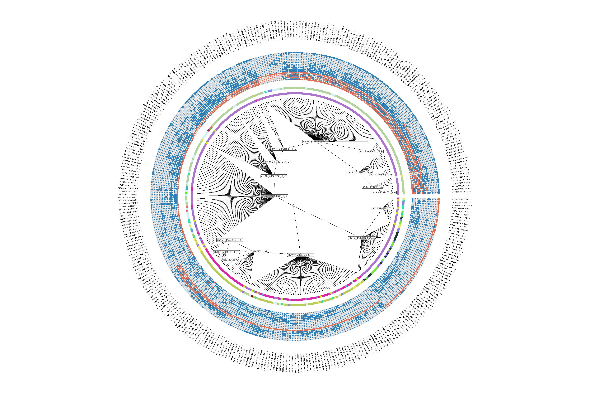

# PhyloSOLIDvis

**Visualization Suite for PhyloSOLID Phylogenetic Trees**

## Overview

PhyloSOLIDvis generates publication-ready circular (circos-style) phylogenetic tree visualizations with:

- ✨ **Circos-style circular plots** with integrated mutation heatmaps
- 🔬 **Cell annotation layers** (types, clusters, samples, tumor scores, B cell proportions)
- 🧬 **Genotype flipping visualization** (input vs inferred states)
- 🎯 **Target mutation highlighting**
- 📊 **Heatmap visualization** for mutation profiles
- 🔄 **Flexible workflow** with independent functions for each step

## Example Output

Below is an example circos plot generated from PhyloSOLID output (351 cells, 17 mutations):



## Installation

### One-line installation (recommended)

```r
remotes::install_github("TsingYang1112/PhyloSOLIDvis", dependencies = TRUE)
```

### Alternative with devtools

```r
devtools::install_github("TsingYang1112/PhyloSOLIDvis", dependencies = TRUE)
```

## Quick Start

**Note:** `ggplot2` must be loaded before `PhyloSOLIDvis` to avoid namespace conflicts.

```r
library(ggplot2)
library(PhyloSOLIDvis)

# Run the complete pipeline (matrix ordering + circos plot + heatmap)
results <- run_all(
  inputpath = "path/to/workdir/sampleid/03_tree_building/mutation_integrator/phylo/",
  outputpath = "path/to/output/",
  annotation_file = "path/to/annotations.txt"
)

# Or run individual steps:
# Step 1: Order matrix
order_result <- order_matrix(
  inputpath = "path/to/phylo/",
  outputpath = "path/to/output/"
)

# Step 2: Generate circos plot
result_circos <- plot_circos(
  inputpath = "path/to/phylo/",
  outputpath = "path/to/output/",
  annotation_file = "path/to/annotations.txt"
)

# Step 3: Generate heatmap
result_heatmap <- plot_heatmap(
  inputpath = "path/to/phylo/",
  outputpath = "path/to/output/"
)
```

### Locating the correct input directory

After running PhyloSOLID with `--workdir ./results` and `--sample SAMPLE_ID`, the required files are located in:

```
workdir/
└── SAMPLE_ID/
    └── 03_tree_building/
        └── mutation_integrator/
            └── phylo/
                ├── final_cleaned_I_full_withNA3_for_circosPlot.txt
                ├── final_cleaned_M_full_basedPivots.filtered_sites_inferred.CFMatrix
                ├── df_flipping_count_for_each_mut.txt
                ├── df_total_flipping_count.txt
                └── df_barcode_clones_from_phylo_tree.csv
```

**Set `inputpath` to this `phylo/` directory.**

## Functions

| Function | Description |
|----------|-------------|
| `run_all()` | Run complete pipeline (matrix ordering + circos plot + heatmap) |
| `order_matrix()` | Sort the mutation matrix and generate ordered metadata |
| `plot_circos()` | Generate circular phylogenetic tree plot |
| `plot_heatmap()` | Generate heatmap visualization |

## Parameters

### plot_circos Parameters

| Parameter | Default | Description |
|-----------|---------|-------------|
| `inputpath` | (required) | Path to `phylo/` directory containing PhyloSOLID output files |
| `outputpath` | (required) | Path to output directory for saving plots |
| `annotation_file` | NULL | Path to cell annotation file (TSV format, optional) |
| `target_mut` | "no" | Target mutation ID to highlight |
| `selected_mutlist` | "all" | Comma-separated list of mutations to include |
| `manual_fp_file` | "no" | Path to manual false positive annotation file |
| `tip_label_offset` | 10 | Offset distance for tip labels |
| `tip_label_size` | 2.5 | Font size for tip labels |
| `tip_point_size` | 0.5 | Size of tip points |
| `heatmap_width` | 0.3 | Width of heatmap track |
| `heatmap_circos_offset` | 0.04 | Offset for heatmap from tree |
| `flipping_point_size` | 0.2 | Size of flipping marker points |
| `plot_height` | 12 | Output plot height (inches) |
| `plot_width` | 18 | Output plot width (inches) |
| `verbose` | TRUE | Print progress messages |

### plot_heatmap Parameters

| Parameter | Default | Description |
|-----------|---------|-------------|
| `inputpath` | (required) | Path to `phylo/` directory |
| `outputpath` | (required) | Path to output directory |
| `ordered_metadata_file` | NULL | Path to ordered_metadata_for_heatmap.txt |
| `colors` | c("#D4E8F0", "#7D2224") | Colors for 0 and 1 values |
| `na_color` | "white" | Color for NA/missing values |
| `show_colnames` | TRUE | Show column names (mutation IDs) |
| `show_rownames` | FALSE | Show row names (cell IDs) |
| `cluster_cols` | FALSE | Cluster columns (mutations) |
| `border_color` | NA | Border color for heatmap cells |

### run_all Parameters

`run_all()` accepts all parameters from `plot_circos()` and `plot_heatmap()` plus:

| Parameter | Default | Description |
|-----------|---------|-------------|
| `run_adjusted` | FALSE | Run adjusted plot with different parameters |
| `adjusted_tip_label_offset` | 6 | Tip label offset for adjusted plot |
| `adjusted_flipping_point_size` | 1.3 | Flipping point size for adjusted plot |
| `heatmap_colors` | c("#D4E8F0", "#7D2224") | Colors for heatmap |
| `heatmap_na_color` | "white" | Color for NA values in heatmap |

## Required Input Files

All required files are located in the `phylo/` directory after running PhyloSOLID:

| File | Description |
|------|-------------|
| `final_cleaned_I_full_withNA3_for_circosPlot.txt` | Input genotype matrix |
| `final_cleaned_M_full_basedPivots.filtered_sites_inferred.CFMatrix` | Conflict-free matrix |
| `df_flipping_count_for_each_mut.txt` | Per-mutation flipping statistics |
| `df_total_flipping_count.txt` | Total flipping statistics |
| `df_barcode_clones_from_phylo_tree.csv` | Clone assignment and color information for each cell |

### Annotation File Format (Optional)

The annotation file (TSV format) should contain a `barcode` column and can include any of the following columns:

| Column | Description |
|--------|-------------|
| `cluster_info` | Cell cluster assignments |
| `cell_type` | Cell type annotations |
| `sample` | Sample identifiers |
| `tumor_score` | Numeric tumor scores |
| `B_cell_prop` | B cell proportions |

**Note:** `annotation_file` is optional. If not provided, the plot will be generated without annotation layers (tree + heatmap only).

## Output Files

| File | Description |
|------|-------------|
| `No_target.circle_tree_output_as_point.*.svg/pdf` | Main circular plot (no legend embedded) |
| `legend_components.circos_annotation.svg/pdf` | Circos annotation legend |
| `legend_components.total_flipping_count.svg/pdf` | Flipping count legend |
| `sorted_cf_matrix.txt` | Sorted mutation matrix |
| `ordered_metadata_for_heatmap.txt` | Heatmap ordering data |
| `CNVtree_data_clone_order_tree.rds` | Tree structure data |
| `df_muts_corresponding_to_ordered_tiplabels_by_anticlockwise.txt` | Mutation-cell mapping |
| `heatmap_and_histograms_for_our_tree.pdf` | Heatmap plot |
| `heatmap_preview.png` | Heatmap preview |
| `phylo_tree.rds` | Phylogenetic tree object |

## Interactive Online Inspection Platform

For interactive post-analysis and quality control, you can upload your PhyloSOLIDvis outputs to our dedicated web server:

**Web Server**: [https://phylosolid.westlake.edu.cn](https://phylosolid.westlake.edu.cn)

> **🔐 Access:** Please register with your **institutional email address** (e.g., `@*.edu`, `@*.ac.cn`, `@*.edu.cn`) to access the platform. Registration is free for academic users.

**Features:**
- Interactive Circos exploration with zoom and cell-level query
- Tree topology evaluation and quality control
- Genotype flip statistics for assessing tree reliability
- Optional upload of IGV snapshots and ANNOVAR annotation results

### Required Upload Files

To initialize a project on the web platform, you'll need the following files from your PhyloSOLIDvis output:

| Upload Field | Required File | Description |
|:-------------|:--------------|:------------|
| **Binary matrix for circos heatmap layer** | `ordered_metadata_for_heatmap.txt` | Ordered cell IDs with metadata for heatmap |
| **Ordered cell IDs with top mutations** | `df_muts_corresponding_to_ordered_tiplabels_by_anticlockwise.txt` | Mutation order for circos plot |
| **Circos plot (SVG format)** | `No_target.circle_tree_output_as_point.*.svg` | Main circular tree plot |
| **Legend figure** | `legend_components.circos_annotation.svg` | Annotation legend for circos plot |
| **Global flip statistics** | `df_total_flipping_count.txt` | Total genotype flipping statistics |
| **Per-mutation flip statistics** | `df_flipping_count_for_each_mut.txt` | Per-mutation flipping statistics |

### Where to Find These Files

After running `plot_circos()` or `run_all()`:

```
your_output_directory/
├── ordered_metadata_for_heatmap.txt
├── df_muts_corresponding_to_ordered_tiplabels_by_anticlockwise.txt
├── No_target.circle_tree_output_as_point.*.svg
├── legend_components.circos_annotation.svg
├── df_total_flipping_count.txt          (from PhyloSOLID phylo/ directory)
└── df_flipping_count_for_each_mut.txt   (from PhyloSOLID phylo/ directory)
```

> **Note:** The flip statistics files (`df_total_flipping_count.txt` and `df_flipping_count_for_each_mut.txt`) are located in the `phylo/` directory from your PhyloSOLID run (`03_tree_building/mutation_integrator/phylo/`). You'll need to copy them to your visualization output directory or upload them separately.

### After Submission

1. Your task appears on the **Results page** with a unique Job ID
2. Click **Open** to launch the interactive viewer
3. The interface displays your circos tree with:
   - **Interactive zoom and pan** for detailed inspection
   - **Clickable cells** that reveal mutation profiles and barcodes
   - **Annotation panel** showing genotype flip statistics
4. Use the annotation panel to assess tree reliability:
   - **Excessive false-positive signals** (1→0 transitions) indicate low reliability
   - **High false-negative signals** (0→1 transitions) suggest missing data issues

### Deep Inspection Features

At the bottom of the webpage, you can upload supplementary files for deeper validation:

- **ANNOVAR variant annotation results**: Examine gene context, genomic regions, and functional predictions for each mutation
- **IGV snapshot figures** (PNG format): Visualize raw sequencing reads at each mutation site
  - Each PNG must be named with the exact mutation ID (e.g., `chr1_39034563_T_A.png`)
  - Must correspond with a single IGV genomic region

### Example Use Case

1. Run PhyloSOLIDvis to generate your circos plot and heatmap
2. Upload the required files to the web platform
3. Interactively explore the tree to verify mutation placements
4. Check flip statistics to identify potentially unreliable mutations
5. For suspicious mutations, upload IGV snapshots to validate raw read evidence
6. Use ANNOVAR results to understand the functional context of each mutation

This workflow enables rigorous quality control before finalizing your phylogenetic tree for publication.

## Run Demo

After installation, you can test the package with the built-in demo data.

### Using the demo script

```bash
# Download and run the demo script
wget https://raw.githubusercontent.com/TsingYang1112/PhyloSOLIDvis/main/run_demo.R
Rscript run_demo.R
```

Or in R:

```r
# Source the demo script
demo_script <- system.file("examples/example_usage.R", package = "PhyloSOLIDvis")
source(demo_script)
```

### Manual demo run

```r
library(ggplot2)
library(PhyloSOLIDvis)

demo_path <- system.file("examples/input", package = "PhyloSOLIDvis")
output_path <- "demo_output/"
annotation_file <- system.file("examples/annotation.txt", package = "PhyloSOLIDvis")

# Run complete pipeline with demo data
results <- run_all(
  inputpath = demo_path,
  outputpath = output_path,
  annotation_file = annotation_file,
  tip_label_offset = 6,
  heatmap_circos_offset = 0.05,
  flipping_point_size = 1.3,
  run_adjusted = TRUE,
  adjusted_tip_label_offset = 6,
  adjusted_flipping_point_size = 1.3,
  verbose = TRUE
)

# View generated files
list.files(output_path)
```

## Troubleshooting

### ggplot2 must be loaded first

Always load `ggplot2` before `PhyloSOLIDvis`:

```r
library(ggplot2)
library(PhyloSOLIDvis)
```

### Network issues during installation

Try using a CRAN mirror:

```r
options(repos = c(CRAN = "https://mirrors.tuna.tsinghua.edu.cn/CRAN/"))
options(BioC_mirror = "https://mirrors.tuna.tsinghua.edu.cn/bioconductor")
remotes::install_github("TsingYang1112/PhyloSOLIDvis", dependencies = TRUE)
```

### Missing dependencies

Install dependencies manually:

```r
# CRAN packages
install.packages(c("ape", "circlize", "cowplot", "dplyr", "ggplot2", "tidyr"))

# Bioconductor packages
BiocManager::install(c("ggtree", "ggtreeExtra", "treeio", "ComplexHeatmap"))

# GitHub packages
remotes::install_github("xiayh17/converTree")
```

## Acknowledgments

The author thanks **Yonghe Xia** for initial conceptualization of the visualization approach and for providing the [converTree](https://github.com/xiayh17/converTree) package, which is used for tree construction from conflict-free matrices.

## Author

**Qing Yang**  
*Westlake University, School of Life Sciences*  
Email: yangqing@westlake.edu.cn  
ORCID: 0009-0005-7366-6879  
GitHub: [@TsingYang1112](https://github.com/TsingYang1112)

## License

MIT © Westlake University

## Citation

If you use PhyloSOLID in your research, please cite:

1. Yang, Q. et al. PhyloSOLID: Robust phylogeny reconstruction from single-cell data despite inherent error and sparsity. (2026) doi:10.64898/2026.02.04.703905.